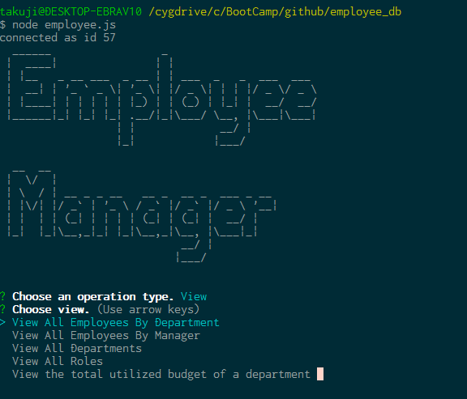

# employee_db
This is a CLI application that manages Employee database.  

Usage 

1.	Ensure MySQL and node.js is installed as this application was developed using node.js. 
2.	Download this application by git or clicking “Download ZIP” button in the github website. 

$ git clone https://github.com/tak-9/employee_db.git 

3.	Install libraries. 

$ npm install 

4.  Create database and insert data to MySQL. Run data.sql and emp.sql on MySQL. 

5.	Open ./util/mysql.cfg and edit MySQL configuration. Change MySQL password if necessary. 

6. Run application. 

$ node employee.js 

7.	Select an item in the menu to perform search, add, update, delete an entry in the database. 
8.	The application ends when the database operation is completed.  

Please repeat the above step if you need to perform another database query.  

Following technologies were used to develop the application.
* Node.js 
* MySQL
* Inquirer https://www.npmjs.com/package/inquirer

